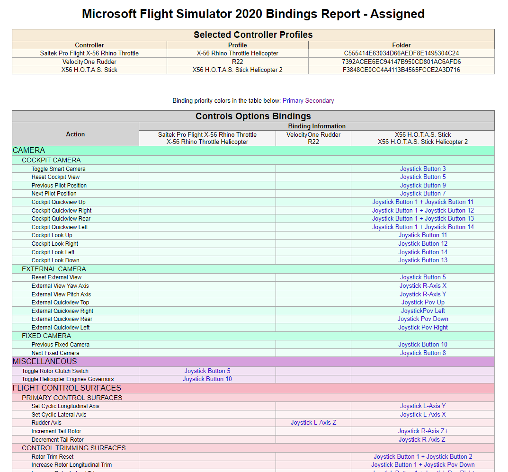

# Microsoft Flight Simulator 2020 Controller Profiles Utility

This utility was born out of frustration that Asobo have given users no easy way to
export and compare what bindings have been set up in different controller profiles.

You can use it to select multiple controller profiles (e.g. Mouse, Flight Stick, 
Flight Throttle and Rudder Pedals), and display an HTML formatted document showing
each available control binding, and the controller & input bound to it.

**Ways to use:**
* Select a single profile to see all its bindings.
* Select two different profiles for a controller to compare bindings.
* Select your active controller profiles to get a list of all current bindings.

## To Run
To run the program:
* first download the release and put in a folder on your computer.
* Navigate to the folder, and double click on the MSFS2020.Profiles.exe
* If you are running a native install, it should automatically populate the path and the list of detected profiles.
* If the profiles are not automatically displayed, you will need to:
  * Either enter or paste the actual path, or use the `Select Profile Path` button to browse to it.
  * Once the path has been chosen, click the `Process Folders` button to detect any profiles.
* Now tick the profiles you wish to include in the report.
* Click the `Generate Binding Report` button to generate the report.

## Flight Sim Platform Support
| Platform Name  | Status           | Comment                                                                                 |
|----------------|------------------|-----------------------------------------------------------------------------------------|
| Windows Native | Full Support     | Utility should automatically detect the controller profile path                         |
| Windows Steam  | Possible Support | Untested, but may work if you manually choose the path to the parent folder of profiles |
| XBox           | Not Supported    |                                                                                         |

## Sample Output

## Roadmap
Things I hope to add in the future...
* Version 1
	* Better support for Steam installations.
	* A "difference" layout better suited to comparing bindings between two or more profiles.
	* A Prettier UI.
	* Create an application installer.
* Version 1.1
    * A way compare one of your profiles against someone else's.
