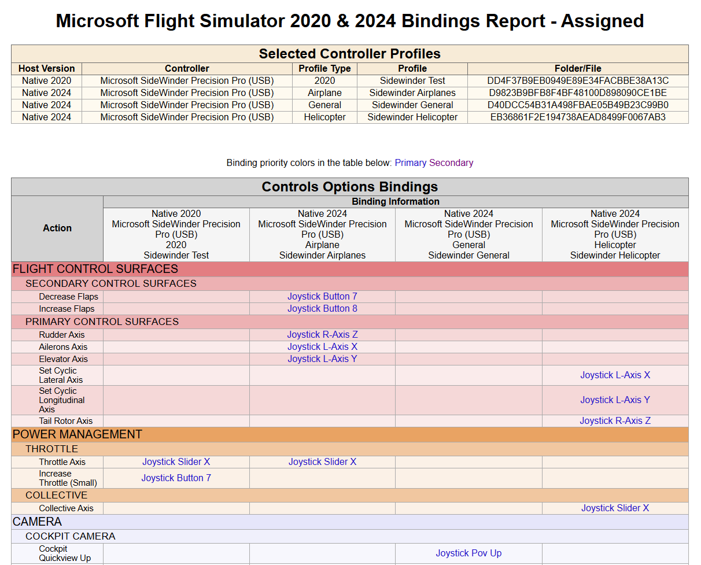

# Microsoft Flight Simulator 2020 Controller Profiles Utility

This utility was born out of frustration that Asobo have given users no easy way to
export and compare what bindings have been set up in different controller profiles.

You can use it to select multiple controller profiles (e.g. Mouse, Flight Stick, 
Flight Throttle and Rudder Pedals), and display an HTML formatted document showing
each available control binding, and the controller & input bound to it.

**Ways to use:**
* Select a single profile to see all its bindings.
* Select two different profiles for a controller to compare bindings.
* Select a set of controller profiles to get a list of all current bindings.

## To Install
To install the utility, perform the following steps:
* Download the installer from the latest release.
* Run the installer. You may have to click through a security warning.
* Accept the defaults and install.

The installer will currently set up a desktop shortcut and a menu folder and item.

## To Run
To run the program:
* Launch the program using either the menu item or desktop shurtcut.
* On first use, you may get a message to install the .NET 8 runtime. If you get the
  warning, you must install the runtime for the utility to work.
* If you are running a native Flight Simulator 2020 install, it should automatically
  populate the path and the list of detected profiles.
* If the profiles are not automatically displayed, you will need to:
  * Either enter or paste the actual path, or use the `Select Profile Path` button
    to browse to it.
  * Once the path has been chosen, click the `Process Folders` button to detect any
    profiles. This will populate the list of detected profiles.
* Now tick the profiles you wish to include in the report.
* Click the `Generate Binding Report` button to generate the report.

### Program UI
See the screenshot below for an example of the program UI, showing all the detected
controller profiles, with a set selected to generate a report. Note the `All` list
content is selected. This will output a report showing all known bindings, rather than
just those for which the selected controller profiles have a binding.

If the `Include Uncategorised` checkbox is ticked, then an additional section will be included
on the report showing controller bindings which could not be matched to an entry in control options
list.

### Command Line Arguments
The program does support two command line options, both of which are aimed at development use and not needed for normal operation.

| Short | Long Name | Description                                                                                                                                       |
|:-----:|:---------:|---------------------------------------------------------------------------------------------------------------------------------------------------|
| -d    | -debug    | Outputs the selected bindings data as an XML file                                                                                                 |
| -p    | -profiles | Space delimited list (e.g. `-p 0 2 5`) of profiles to select by number, starting at 0. Only useful if you are running the program multiple times. |

## Flight Sim Platform Support
| Platform Name  | Status           | Comment                                                                                 |
|----------------|------------------|-----------------------------------------------------------------------------------------|
| Windows Native | Full Support     | Utility should automatically detect the controller profile path                         |
| Windows Steam  | Possible Support | Untested, but may work if you manually choose the path to the parent folder of profiles |
| XBox           | Not Supported    |                                                                                         |

## Sample Output

## Developer Utility
Included in the source code (but not the releases) is the developer utility `FSProfiles.Builder`, which allows adding new menu items
to the `KnownBindings.xml` file. This file is used to generate the bindings report, by supplying the mapping between the `Controls Options`
list and the action bindings recorded against controller inputs.

From time to time, Asobo adds additional control options, so this program is used to build a new `KnownBindings.xml` file.
To use the utility (once built). Add new menu options to the `FS2020 Options.csv` file, then run the utility.

## Roadmap
Things I hope to add in the future...
* **Version 1**
	* Better support for Steam installations.
	* A prettier UI.
* **Version 1.1** 
  (not sure how to do these securely/safely in our modern virus and hacker saturated world)
	* An option to "export" a set of profiles so they can sent to another user for comparison.
	* An option to "import" a profile from another user for comparison only. Note there will be no way to actually import these to FS2020, as Asobo manage user profiles in the cloud.
