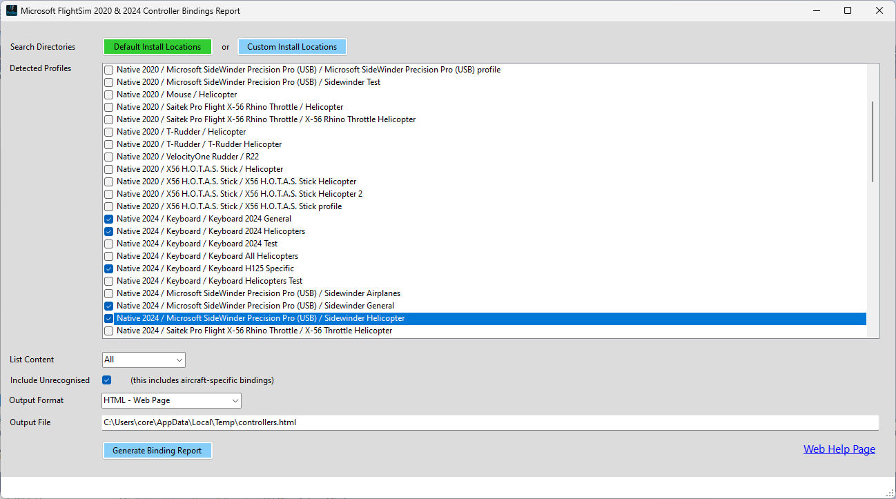

# Microsoft Flight Simulator 2020 & 2024 Controller Profiles Utility

This utility was born out of frustration that Asobo have given users no easy way to
export and compare what bindings have been set up in different controller profiles.

You can use it to select multiple controller profiles (e.g. Mouse, Flight Stick, 
Flight Throttle and Rudder Pedals), and display an HTML formatted document showing
each available control binding, and the controller & input bound to it.

So far, the utility has only been tested with a native Windows desktop install of
FS2020 and FS2024. Some work has also been done to support Steam-based installs, 
but the FS2024 version is untested by actual Steam users.

**Special FS2024 Notes:**
* The FS2024 version massively increased the number of control binding options
  (from approx 1200 to somewhere in excess of 2400).
* As a result, I have not yet managed to map all general and type-related (e.g.
  fixed wing, helicopter) bindings to their in-game order in the controls binding
  screen.
* All unmapped binding options (including ***all*** aircraft-specific bindings) will be
  included in the "uncategorised" section at the end of the report.
* When the selected profiles includes a mix of both FS2020 and FS2024 profiles, the
  FS2024 control binding UI order will be used.

**Example ways to use:**
* Select profiles from FS2020 and FS2024 to compare/identify what needs setting up in FS2024.
* Select a single profile to see all its bindings.
* Select two different profiles for the same controller to compare bindings.
* Select a set of controller profiles to get a list of all current bindings.

## To Install
To install the utility, perform the following steps:
* Download the installer from the latest project release (or from [Flightsim.to](https://flightsim.to/file/79474/fsprofiles)).
* Run the installer. You may have to click through a security warning.
* Accept the defaults and install.
* When you first run the program, you may get a message to install the .NET 8 runtime. If you get the
  warning, you *must* install the runtime for the utility to work.

The installer will currently set up a desktop shortcut and a menu folder and item.

## To Run
To run the program:
* Launch the program using either the menu item or desktop shurtcut.
* On first use, you may get a message to install the .NET 8 runtime. If you get the
  warning, you must install the runtime for the utility to work.
* Once the main form has shown, it will automatically check all of the default
directories for Native Windows and Steam installs, for both FS2020 and FS2024. The detected
controller profiles will be displayed in the Detected Profiles list.
*  If you did a custom install, click the `Custom Install Locations` button to enter the
actual install path. The popup form will automatically show the standard install locations.
When you have finished, Click the `Save & Exit` button. The program will then search the
specified loations and display the results in the Detected Profiles list.
* Now tick the profiles you wish to include in the report.
* Choose which bindings to include:
  * All - all known bindings
  * Assigned - only those currently mapped to an input
  * New - only those not currently mapped to an input.
  * Difference - only those where there is a difference.
* Tick the `Include Uncategorised` if you want to include new bindings which have not been
  put into a structure yet (currently this is all of the new FS2024 bindings).
* Choose the output format - either html for a coloured web page, or CSV for a file you can
  open in Excel.
* Click the `Generate Binding Report` button to generate the report.

### Program UI
See the screenshot below for an example of the program UI, showing a `Native Windows`
install was selected, all the detected controller profiles, with a set selected to
generate a report. Note the `All` list content is selected. This will output a report
showing all known bindings, rather than just those for which the selected controller
profiles have a binding.

If the `Include Uncategorised` checkbox is ticked, then an additional section will be
included on the report showing controller bindings which could not be matched to an 
entry in the control options list.

#### Main Form

#### Custom Locations Form

### Command Line Arguments
The program does support two command line options, both of which are aimed at development use and not needed for normal operation.

| Short | Long Name | Description                                                                                                                                       |
|:-----:|:---------:|---------------------------------------------------------------------------------------------------------------------------------------------------|
| -d    | -debug    | Outputs the selected bindings data as an XML file                                                                                                 |
| -p    | -profiles | Space delimited list (e.g. `-p 0 2 5`) of profiles to select by number, starting at 0. Only useful if you are running the program multiple times. |

## Flight Sim Platform Support
| Platform Name  | Status        | Comment                                                                                                                |
|----------------|---------------|------------------------------------------------------------------------------------------------------------------------|
| Windows Native | Full Support  | Utility should automatically detect the controller profile path for a default install                                  |
| Windows Steam  | Supported     | Untested, but should work automatically, or you may need to manually choose the path to the parent folder of profiles. |
| XBox           | Not Supported |                                                                                                                        |

## Sample Output

## More Information
Please see the project [wiki](https://github.com/iadarroch/FSProfiles/wiki) for additional information.
